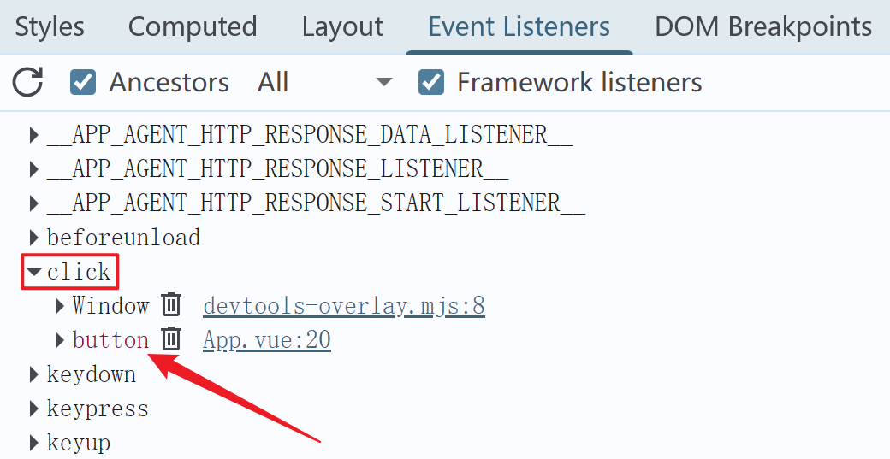

# 1. 如何绑定一个点击事件

App.vue

```html
<template>
  <button ref="btn">click</button>
</template>

<script setup lang="ts">
import { onMounted, onUnmounted, useTemplateRef } from 'vue'
const oBtn = useTemplateRef('btn')

const handleClick = () => {
  console.log('金山训练营')
}
onMounted(() => {
  oBtn.value?.addEventListener('click', handleClick)
})
onUnmounted(() => {
  oBtn.value?.removeEventListener('click', handleClick)
})
</script>
```

# 2. 抽离变化的部分进行封装

src\hooks\useEventListener.ts

```ts
import { onMounted, onUnmounted, unref, type MaybeRef } from 'vue'

export const useEventListener = (
  ele: MaybeRef<HTMLElement | null>,
  type: string,
  callback: EventListener,
  options?: AddEventListenerOptions,
) => {
  onMounted(() => {
    unref(ele)?.addEventListener(type, callback, options || false)
  })
  onUnmounted(() => {
    unref(ele)?.removeEventListener(type, callback, options || false)
  })
}

```

App.vue

```html
<template>
  <button ref="btn">click</button>
</template>

<script setup lang="ts">
import { useTemplateRef } from 'vue'
import { useEventListener } from './hooks/useEventListener'
const oBtn = useTemplateRef('btn')

const handleClick = () => {
  console.log('金山训练营')
}
useEventListener(oBtn, 'click', handleClick)
</script>
```

给 document.documentElement 绑定事件进行测试

```ts
useEventListener(document.documentElement, 'click', handleClick)
```

# 3. 内存优化，事件解绑

元素销毁，应解绑此元素身上的事件监听

特点：元素销毁，最终此元素会变成 null，证明，App.vue

```js
<template>
  <!-- #2 -->
  <button ref="btn" v-if="visible">click</button>
</template>

<script setup lang="ts">
import { nextTick, ref, useTemplateRef } from 'vue'
import { useEventListener } from './hooks/useEventListener'
const oBtn = useTemplateRef('btn')
// #1
const visible = ref(true)

// #3
setTimeout(async () => {
  visible.value = false
  await nextTick()
  console.log(oBtn.value) // null
}, 3000)

const handleClick = () => {
  console.log('金山训练营')
}
useEventListener(oBtn, 'click', handleClick)
</script>

```

所以可以通过监听 DOM 的变化做一些处理：

```ts
import { watch, onUnmounted, unref, type MaybeRef } from 'vue'

export const useEventListener = (
  ele: MaybeRef<HTMLElement | null>,
  type: string,
  callback: EventListener,
  options?: AddEventListenerOptions,
) => {
  // 首页触发 watch => unref(ele) 的值是 null => 获取到元素（onMounted）
  // 最后触发 watch => unref(ele) 的值是 DOM 元素 => null
  let rmEvent = () => {}
  watch(
    () => unref(ele),
    (el) => {
      rmEvent()
      if (!el) return
      el?.addEventListener(type, callback, options || false)
      rmEvent = () => el?.removeEventListener(type, callback, options || false)
    },
  )
  onUnmounted(() => {
    rmEvent()
  })
}

```

如何观测一个元素上的事件还在不在？




# 5. 返回一个函数，让外界随时可以解绑

```ts
import { watch, onUnmounted, unref, type MaybeRef } from 'vue'

export const useEventListener = (
  ele: MaybeRef<HTMLElement | null>,
  type: string,
  callback: EventListener,
  options?: AddEventListenerOptions,
) => {
  // 首页触发 watch => unref(ele) 的值是 null => 获取到元素（onMounted）
  // 最后触发 watch => unref(ele) 的值是 DOM 元素 => null
  let rmEvent = () => {}
  watch(
    () => unref(ele),
    (el) => {
      rmEvent()
      if (!el) return
      el?.addEventListener(type, callback, options || false)
      rmEvent = () => el?.removeEventListener(type, callback, options || false)
    },
  )
  onUnmounted(() => {
    rmEvent()
  })
  return () => {
    rmEvent()
  }
}

```


# 6. 内存优化，取消监听

rmEvent 调用的时候也取消 watch 监听，避免内存泄漏，至于组件卸载的时候，watch 会自动干掉的。

```ts
import { watch, onUnmounted, unref, type MaybeRef } from 'vue'

export const useEventListener = (
  ele: MaybeRef<HTMLElement | null>,
  type: string,
  callback: EventListener,
  options?: AddEventListenerOptions,
) => {
  // 首页触发 watch => unref(ele) 的值是 null => 获取到元素（onMounted）
  // 最后触发 watch => unref(ele) 的值是 DOM 元素 => null
  let rmEvent = () => {}
  const unWatch = watch(
    () => unref(ele),
    (el) => {
      rmEvent()
      if (!el) return
      el?.addEventListener(type, callback, options || false)
      rmEvent = () => el?.removeEventListener(type, callback, options || false)
    },
  )
  onUnmounted(() => {
    rmEvent()
  })
  return () => {
    rmEvent()
    unWatch()
  }
}

```

# 7. 期望 hook 不仅仅在中生效

onScopeDispose，当副作用函数所在的作用域销毁应移除监听

```ts
import { watch, unref, type MaybeRef, onScopeDispose } from 'vue'
export const useEventListener = (
  ele: MaybeRef<HTMLElement | null>,
  type: string,
  callback: EventListener,
  options?: AddEventListenerOptions,
) => {
  // 首页触发 watch => unref(ele) 的值是 null => 获取到元素（onMounted）
  // 最后触发 watch => unref(ele) 的值是 DOM 元素 => null
  let rmEvent = () => {}
  const unWatch = watch(
    () => unref(ele),
    (el) => {
      rmEvent()
      if (!el) return
      el?.addEventListener(type, callback, options || false)
      rmEvent = () => el?.removeEventListener(type, callback, options || false)
    },
  )
  onScopeDispose(() => {
    rmEvent()
  })
  return () => {
    rmEvent()
    unWatch()
  }
}

```

测试，App.vue

```html
<template>
  <button ref="btn">click</button>
  <button @click="clearEffect">清理副作用</button>
</template>

<script setup lang="ts">
import { effectScope, useTemplateRef } from 'vue'
import { useEventListener } from './hooks/useEventListener'
const oBtn = useTemplateRef('btn')

const handleClick = () => {
  console.log('金山训练营')
}

const scope = effectScope()
scope.run(() => {
  useEventListener(oBtn, 'click', handleClick)
})

const clearEffect = () => {
  // 停止 scope 作用域内所有的 effect，一旦停止，会触发作用域内的 onScopeDispose 回调
  scope.stop()
}
</script>
```

